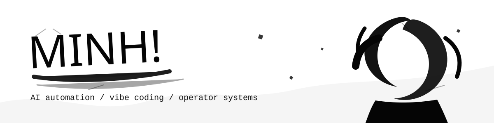
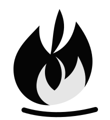

  
  &nbsp;
  
  &nbsp;
  

 

  <h2>Know About Me</h2>

  <h3>Hey there! I'm Minh Nguyen</h3>
  I build practical AI automation systems, agent workflows, and open-source skill packs for people who want to ship faster without turning their process into chaos. My work sits around vibe coding, local AI tooling, marketing operations, desktop companions, and small systems that remove repeated manual work.
    

  

  

  <h3>Top Projects (built to make work feel lighter)</h3>
  &nbsp; 63 bilingual AI marketing skills for Codex, Claude Code, OpenCode, and VS Code. 
  &nbsp; Ollama Cloud API key routing with provider rotation and practical failover. 
  &nbsp; A desktop companion for the Hermes agent workflow. 
  &nbsp; A FastAPI and Next.js autoposter for operator-style content workflows.

  

 
 

  
    
  
  &nbsp;
  
  &nbsp;
  

 

> Build small systems that remove repeated work.

> Good automation is not magic. It is clear process, sharp prompts, and boring reliability.

 

  
    
  <picture>
    <source media="(prefers-color-scheme: dark)" srcset="https://raw.githubusercontent.com/minhnv0807/minhnv0807/output/github-snake-dark.svg">
    <source media="(prefers-color-scheme: light)" srcset="https://raw.githubusercontent.com/minhnv0807/minhnv0807/output/github-snake.svg">
    
  </picture>

  

  
    

  <table align="center">
    <tr>
      <td align="right" valign="middle"><strong>Frontend</strong></td>
      <td align="left" valign="middle">
        
        
        
        
        
      </td>
    </tr>
    <tr>
      <td align="right" valign="middle"><strong>AI & Backend</strong></td>
      <td align="left" valign="middle">
        
        
        
        
        
      </td>
    </tr>
    <tr>
      <td align="right" valign="middle"><strong>Ops & Tools</strong></td>
      <td align="left" valign="middle">
        
        
        
        
        
      </td>
    </tr>
  </table>

 
